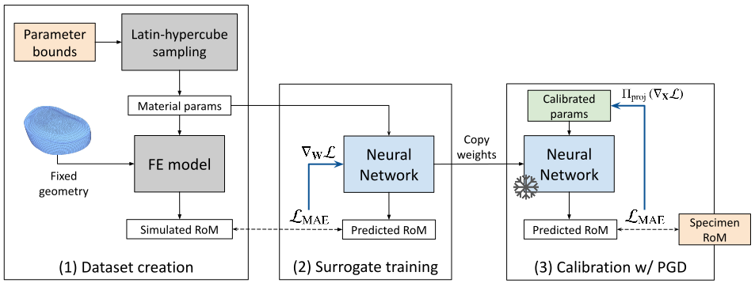

## Don't You (Project Around Discs)? Neural Network Surrogate and Projected Gradient Descent for Calibrating an Intervertebral Disc Finite Element Model

Accurate calibration of finite element (FE) models of human intervertebral discs (IVDs) is essential for their reliability and application in diagnosing and planning treatments for spinal conditions. Traditional calibration methods are computationally intensive, requiring iterative, derivative-free optimization algorithms that often take hours or days to converge.

This study addresses these challenges by introducing a novel, efficient, and effective calibration method for an L4-L5 IVD FE model using a neural network (NN) surrogate. The NN surrogate predicts simulation outcomes with high accuracy, outperforming other machine learning models, and significantly reduces the computational cost associated with traditional FE simulations. Next, a Projected Gradient Descent (PGD) approach guided by gradients of the NN surrogate is proposed to efficiently calibrate FE models. Our method explicitly enforces feasibility with a projection step, thus maintaining material bounds throughout the optimization process.

The proposed method is evaluated against state-of-the-art Genetic Algorithm (GA) and inverse model baselines on synthetic and \textit{in vitro} experimental datasets. Our approach demonstrates superior performance on synthetic data, achieving a Mean Absolute Error (MAE) of 0.06 compared to the baselines’ MAE of 0.18 and 0.54, respectively. On experimental specimens, our method outperforms the baseline in 5 out of 6 cases. Most importantly, our approach reduces calibration time to under three seconds, compared to up to 8 days per sample required by traditional calibration. Such efficiency paves the way for applying more complex FE models, enabling accurate patient-specific simulations and advancing spinal treatment planning.

### Method overview

Our developed method for calibrating an L4-L5 IVD FE model to match in vitro Range-of-Motion (RoM) measurements follows these steps:
1. Create a dataset by sampling material parameters within feasible bounds and obtaining corresponding RoM values with FE simulations. 
2. Train a neural network (NN) surrogate to minimize the Mean Absolute Error (MAE) between the predicted and simulated RoM. 
3. Freeze the network weights and optimize the NN input parameters to match the predicted RoM to the experimental measurements. Projected Gradient Descent (PGD) ensures that the calibrated parameters remain within feasible bounds.

### Installation

To set up the environment, please follow these steps:

1. Install Python 3.10.13 or a compatible version.
2. Install conda.

### Setup

To create the conda environment, execute the following commands:

```shell
conda env create -f IVD-CALIBNN.yml
conda activate IVD-CALIBNN
```

### Usage

Here are the steps to use this repository:

1. **Dataset**: The training set used to train our surrogate models and the synthetic test data can be found in the `/datasets` directory.
2. **Model Checkpoint**: A checkpoint of the trained surrogate neural network is available in the `/trained_models` directory.
3. **Model Training**: To train the surrogate models, refer to the `model_training.ipynb` notebook for the code and hyperparameters.
4. **FE Model Calibration**: For an example code on how to calibrate experimental data, check out the `pgd_calibration.ipynb` notebook.

### Citation

If you use this code or find it helpful in your research, please consider citing our paper:

```
@misc{atad2024ivd,
    title={Don't You (Project Around Discs)? Neural Network Surrogate and Projected Gradient Descent for Calibrating an Intervertebral Disc Finite Element Model},
    author={Matan Atad and Gabriel Gruber and Marx Ribeiro and Luis Fernando Nicolini and Robert Graf and Hendrik Möller and Kati Nispel and Ivan Ezhov and Daniel Rueckert and Jan S. Kirschke},
    year={2024},
    eprint={2408.06067},
    archivePrefix={arXiv},
    note={\url{https://arxiv.org/abs/2408.06067}}
}
```

### License

This project is licensed under the [MIT License](LICENSE).